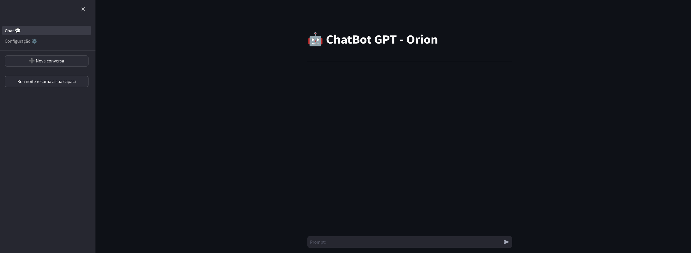
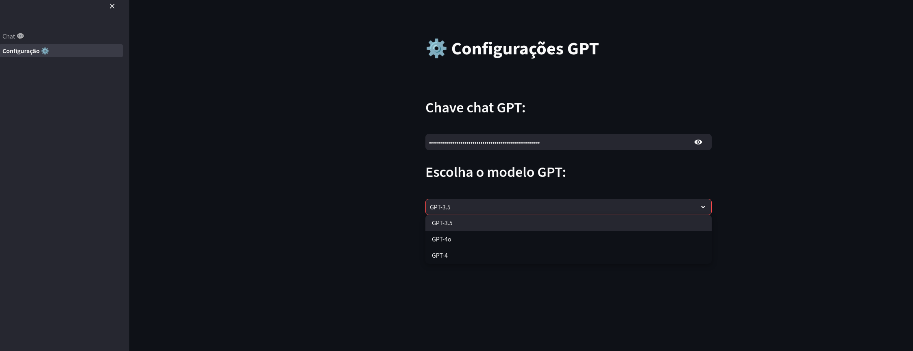
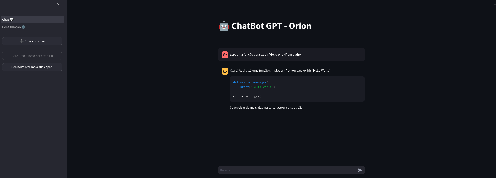

# Chat GPT em Streamlit
Criação de uma réplica do Chat GPT utilizando Streamlit e integrando com a API oficial, permitindo a seleção entre todos os modelos disponíveis, incluindo o GPT-4.

## Requisitos

1. Instale os requerimentos:

```bash
pip install -r requirements.txt
```

2. Execute o aplicativo:

```bash
streamlit run 1_Chat_💬.py
```

## Imagens

* ### Imagem inicial
</img>

* ### Página de configurações
</img>

* ### Exemplo de utilização
</img>
